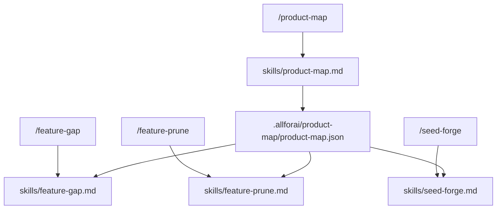

# Design Document

## Overview

对 `product-audit-skill` 的命令层（`commands/`）和技能层（`skills/`）进行重构，使其与已更新的技能设计完全对齐。新增 `product-map` 作为基础技能，重命名两个命令，更新所有命令文件内容，同步插件配置。

## Steering Document Alignment

### Technical Standards
- 复用现有命令文件的结构模式：YAML frontmatter → 模式路由 → 前置检查 → 执行流程 → 详细文档引用 → Step 执行要求 → 报告模板 → 铁律
- `${CLAUDE_PLUGIN_ROOT}` 变量用于所有文档引用路径，保持可移植性

### Project Structure
```
product-audit-skill/
├── skills/
│   ├── product-map.md      ← 新建
│   ├── feature-gap.md      ← 重命名自 feature-audit.md（内容已更新）
│   ├── feature-prune.md    ← 保留（内容已更新）
│   └── seed-forge.md       ← 重命名自 demo-forge.md（内容已更新）
├── commands/
│   ├── product-map.md      ← 新建
│   ├── feature-gap.md      ← 重命名自 feature-audit.md（内容重写）
│   ├── feature-prune.md    ← 保留（内容重写）
│   └── seed-forge.md       ← 重命名自 demo-forge.md（内容重写）
├── SKILL.md                ← 更新
├── README.md               ← 更新
└── .claude-plugin/
    └── plugin.json         ← 更新
```

## Code Reuse Analysis

### Existing Components to Leverage
- **命令文件结构模式**：所有新/更新命令文件沿用现有的 YAML frontmatter + 模式路由 + 铁律结构，不引入新模式
- **`allowed-tools` 配置**：`product-map` 和 `feature-gap` 复用 `feature-audit` 的工具集；`seed-forge` 复用 `demo-forge` 的工具集（含 WebSearch/WebFetch）
- **报告摘要模板格式**：沿用现有命令文件的 Markdown 表格 + 列表格式，保持视觉一致性
- **`${CLAUDE_PLUGIN_ROOT}` 变量**：所有文档路径引用保持此变量，零改动

### Integration Points
- **`skills/*.md` → `commands/*.md`**：命令文件的执行流程引用对应的技能文件，技能文件已全部更新完毕
- **`.allforai/product-map/product-map.json`**：三个依赖技能（feature-gap、feature-prune、seed-forge）的命令文件均在前置检查中读取此文件
- **`docs/plans/2026-02-24-product-map-design.md`**：本次重构范围不含 `docs/` 目录，该文件仅作为 `skills/product-map.md` 的内容来源参考，不修改

### Known Issues to Fix During Implementation
- **`skills/feature-prune.md` Step 2 引用 `scenario-map.json`**：此文件不存在于 product-map 输出中，正确文件名为 `screen-map.json`（位于 `.allforai/product-map/screen-map.json`）。实现 `commands/feature-prune.md` 时须同步修正 `skills/feature-prune.md` 中的此引用。

## Architecture



## Components and Interfaces

### 1. `skills/product-map.md`（新建）
- **Purpose**: 定义 product-map 技能的完整工作流、输出格式、铁律
- **Content structure**: 同其他技能文件：定位 → 快速开始 → 工作流（Step 0–6）→ 输出文件结构 → JSON 示例 → 铁律
- **Source**: 内容来自 `docs/plans/2026-02-24-product-map-design.md`，转换为标准技能文件格式
- **Reuses**: 设计文档中已定义的所有数据结构（role-profiles、task-inventory、screen-map、conflict-report、constraints）

### 2. `commands/product-map.md`（新建）
- **Purpose**: `/product-map` 命令入口，路由到 `skills/product-map.md`
- **Modes**: `full`（默认）/ `quick` / `refresh` / `scope <模块名>`
- **Pre-check**: 检测 `.allforai/product-map/product-map-decisions.json`，自动复用历史决策
- **Report template**: 角色数、任务数、界面数、高频操作列表、冲突数
- **Reuses**: 完全沿用现有命令文件的结构模式

### 3. `commands/feature-gap.md`（重命名 + 重写）
- **Purpose**: `/feature-gap` 命令，替代旧 `/feature-audit`
- **Modes**: `full`（默认）/ `quick` / `journey` / `role <角色名>`
- **Pre-check**:
  - `.allforai/product-map/product-map.json` 必须存在
  - 历史决策向后兼容：优先加载 `.allforai/feature-gap/gap-decisions.json`，若不存在则尝试加载 `.feature-audit/audit-decisions.json`（旧路径兼容，仅读取，不写回旧路径）
- **Report template**: gap 任务清单（按频次排序）、旅程评分（X/4）、flag 分类统计
- **Breaking changes**:
  - 不再支持 `incremental` 和 `verify` 模式
  - 输出目录从 `.feature-audit/` 改为 `.allforai/feature-gap/`（旧目录保留不删除，由用户自行清理）

### 4. `commands/feature-prune.md`（重写）
- **Purpose**: `/feature-prune` 命令，内容对齐新技能设计
- **Modes**: `full`（默认）/ `quick` / `scope <模块名>`（同旧版，模式名不变）
- **Pre-check**:
  - `.allforai/product-map/product-map.json` 必须存在
  - `scope` 模式：检查 `.allforai/feature-prune/frequency-tier.json` 是否存在（替代旧版的 `scenarios.json`），不存在则提示先跑 `full`
  - 自动加载 `.allforai/feature-prune/prune-decisions.json` 历史决策
- **Step 变更**: 旧 Step 0（项目画像+功能收集）已由 `product-map` 承担，新命令从 **Step 1（频次过滤）** 开始，共 5 步（Step 1–5）
- **Key change**: 频次数据从 `.allforai/product-map/task-inventory.json` 直接读取；高频任务自动受保护，不进入剪枝候选

### 5. `commands/seed-forge.md`（重命名 + 重写）
- **Purpose**: `/seed-forge` 命令，替代旧 `/demo-forge`
- **Modes**: `full`（默认）/ `plan` / `fill` / `clean`（模式名与旧版相同）
- **Output directory**: 保持 `.allforai/seed-forge/`（向后兼容，不重命名目录），文件名按新技能设计更新（`forge-plan.json` → `seed-plan.json`，`industry-profile.json` → `style-profile.json`，`project-analysis.json` → `model-mapping.json`）
- **Pre-check**:
  - `.allforai/product-map/product-map.json` 必须存在
  - `fill` 模式：检查 `.allforai/seed-forge/seed-plan.json`，不存在则提示先跑 `plan`
  - `clean` 模式：检查 `.allforai/seed-forge/forge-data.json`，不存在则提示没有可清理的数据；**执行前强制二次确认**（安全要求）
- **Report template**: 各角色账号数、按频次分层的数据量统计、场景链路完成情况、约束违规记录
- **Breaking change**: 文件名变更（旧 `forge-plan.json` → 新 `seed-plan.json`）；旧 `demo-forge plan` 生成的文件不兼容新 `seed-forge fill`

### 6. `SKILL.md`（更新）
- **Purpose**: 插件技能索引，Claude Code 的自动发现入口
- **Changes**: 更新 frontmatter version，更新技能列表（4个）和命令引用

### 7. `plugin.json`（更新）
- **Purpose**: 插件元数据，marketplace 展示和安装配置
- **Changes**: 更新 description，version 升至 `2.0.0`

### 8. `README.md`（更新）
- **Purpose**: 用户文档，介绍插件功能和使用方法
- **Changes**:
  - 将所有 `/feature-audit` 引用替换为 `/feature-gap`
  - 将所有 `/demo-forge` 引用替换为 `/seed-forge`
  - 更新"包含的技能"列表（feature-audit → feature-gap，demo-forge → seed-forge）
  - 更新输出文件表格（`.feature-audit/` → `.allforai/feature-gap/`，`audit-decisions.json` → `gap-decisions.json`）
  - 更新定位图中的技能名称

## Data Models

### 命令文件 YAML frontmatter 规范
```yaml
---
description: "<一句话描述>：<关键特性>。模式: <mode1> / <mode2> / ..."
argument-hint: "[mode: mode1|mode2|...] [可选参数]"
allowed-tools: ["Read", "Write", "Grep", "Glob", "Bash", "Task", "AskUserQuestion"]
---
```

`product-map` 和 `feature-gap` 不需要 WebSearch，`feature-prune` 和 `seed-forge` 需要（竞品搜索、行业风格搜索）。

### 报告摘要模板规范（各命令统一格式）
```
## <技能名>报告摘要
> 执行时间、执行模式、关键参数

### 总览（Markdown 表格）
### 详情列表（逐条，含理由）
### 下一步（编号列表）
> 输出文件路径
```

## Error Handling

### Error Scenarios

1. **前置文件缺失**
   - **Handling**: 命令文件开头前置检查，缺失时输出明确提示（"请先运行 /product-map"），不执行任何 Step
   - **User Impact**: 用户看到清晰的操作指引，不会看到内部错误

2. **历史决策文件存在但格式不兼容**
   - **Handling**: 捕获读取异常，跳过自动加载，从头开始确认流程
   - **User Impact**: 用户需要重新确认已决策项，无数据损失

3. **`seed-forge clean` 数据库连接失败**
   - **Handling**: 记录失败详情到日志，不中断其他表的清理
   - **User Impact**: 报告摘要中列出失败项，用户可手动处理

## Testing Strategy

### Unit Testing
- 每个命令文件的模式路由逻辑通过手动触发不同参数验证

### Integration Testing
- 在测试项目上依次执行 `/product-map` → `/feature-gap` → `/feature-prune` → `/seed-forge plan`，验证数据传递链路

### End-to-End Testing
- 完整执行一次 `/seed-forge`（含 populate），验证数据与 product-map 的角色/频次/约束对齐
